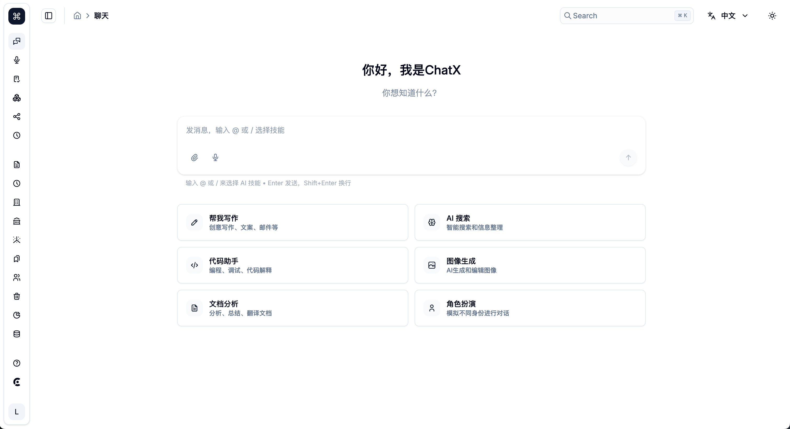
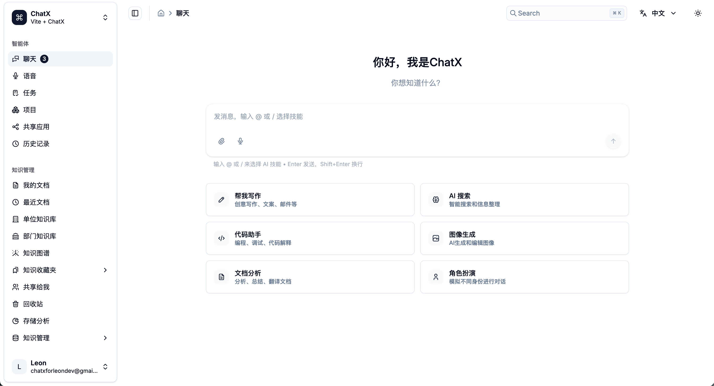
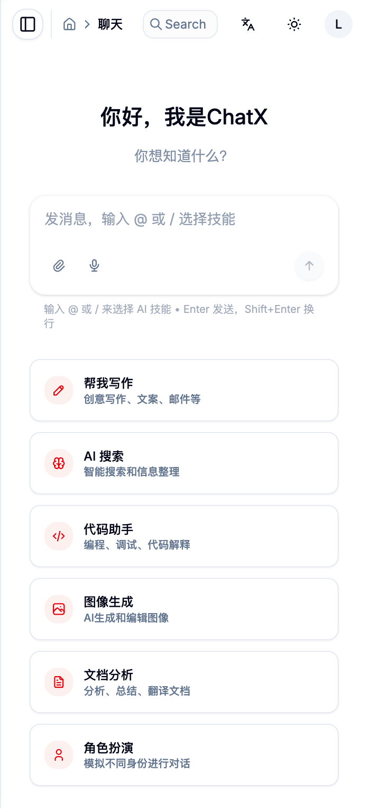
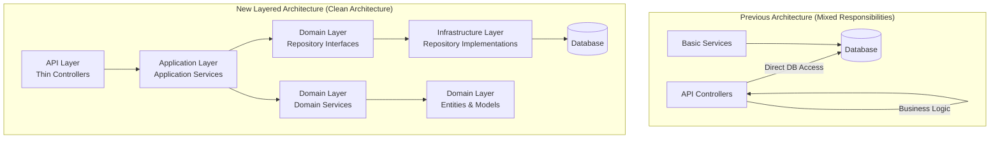
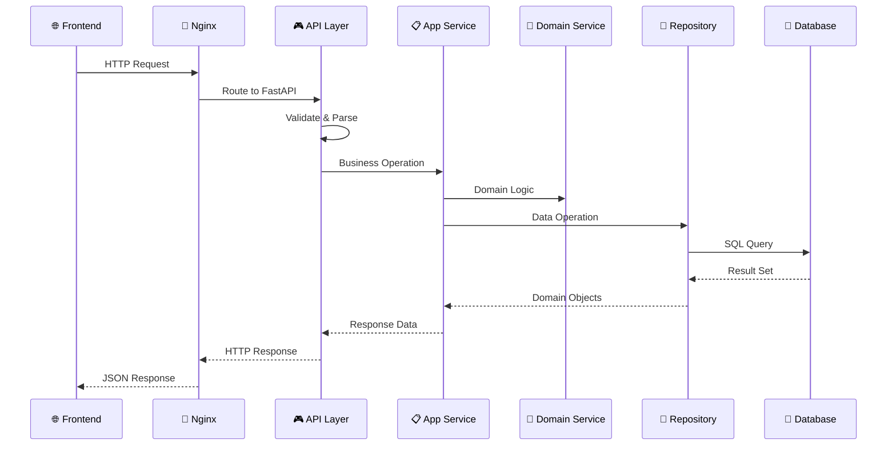
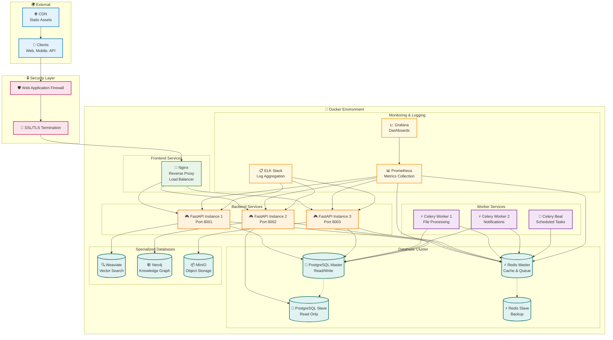

<p align="right">
  <a href="./README.zh-CN.md">
    
  </a>
</p>

# ChatX - A Modern & Intelligent Chat Application

<p align="center">
  
  
</p>
<p align="center">
  
  
</p>

ChatX is a powerful full-stack chat application designed to provide a seamless experience for communication, collaboration, and intelligent file management. It is built with a modern tech stack, featuring a user-centric and customizable frontend, and a stable, scalable enterprise-grade backend.

## ✨ Core Features

### Frontend (UI/UX)

- **Real-time Messaging**: Delivers a smooth instant messaging experience.
- **Enterprise-grade Page Transitions**: Includes 6 professional animation effects (fade, slide, zoom, etc.).
- **Advanced Appearance Customization**: Supports light/dark modes, custom color schemes, border-radius, and font sizes.
- **Responsive & Accessible Design**: Ensures a great user experience on all devices and respects user accessibility preferences.
- **Modern UI Components**: Built with shadcn/ui for a beautiful and easy-to-use interface.
- **Comprehensive Document Management Interface**: User-centric design with intuitive navigation for document workflow management.
- **Enterprise-Grade Knowledge Graph Visualization**: Interactive ECharts-powered graph with dynamic theming and relationship exploration.

### Backend (API & Services)

- **Enterprise-grade Multi-tenant Architecture**:
  - **Tenant Isolation**: Complete data and resource isolation between tenants.
  - **Multi-tenant Security**: Advanced middleware for tenant-specific access controls.
  - **Resource Quotas**: Per-tenant limits and usage monitoring.
  - **Tenant Management**: Dynamic tenant creation and configuration.

- **Advanced RBAC Permission System**:
  - **Role-based Access Control**: Comprehensive RBAC with hierarchical roles.
  - **Fine-grained Permissions**: Resource-level and action-level permission control.
  - **Permission Inheritance**: Role hierarchy with permission inheritance.
  - **Dynamic Permission Assignment**: Runtime permission granting and revocation.
  - **Audit Logging**: Complete permission change tracking and audit trails.
  - **Default Roles**: 6 pre-defined roles from guest to super admin.
  - **Custom Roles**: Create and manage custom roles with specific permissions.

- **Enterprise-grade Document Management System**:
  - **Document Lifecycle**: Full document workflow from upload to archival with version control.
  - **Smart Organization**: Hierarchical folders, intelligent categorization, and flexible tagging system.
  - **Advanced Search**: Multi-dimensional filtering, semantic search, and content-based discovery.
  - **Secure Sharing**: Time-limited sharing links with password protection and access controls.
  - **Storage Analytics**: Detailed usage statistics and storage optimization insights.
  - **File Operations**: Upload/download/delete/rename with SHA256-based deduplication.
  - **Content Intelligence**: Automatic identification and smart categorization of 11+ file types.

- **Advanced Authentication & User Management**:
  - **JWT-based Security**: Secure token-based authentication with refresh tokens.
  - **Session Management**: Multi-device session tracking and management.
  - **User Registration**: Complete user onboarding with email verification.
  - **Password Recovery**: Secure password reset with verification codes.
  - **User Profiles**: Comprehensive user profile management.
  - **Third-party Integration**: OAuth2, LDAP, SAML support ready.
  
- **Enterprise-grade Email Service**:
  - **Multi-provider SMTP**: Gmail, QQ, 163, 腾讯企业邮, 阿里云, SendGrid support.
  - **Verification Codes**: Beautiful HTML email templates for user verification.
  - **Development Mode**: Console-based verification for easy testing.
  - **Production Ready**: Reliable email delivery with fallback mechanisms.
  
- **Super Administrator System**:
  - **Auto-initialization**: One-command setup of admin accounts and permissions.
  - **Multi-tenant Structure**: Default tenant, organization, and department creation.
  - **Role Assignment**: Automatic super admin role with full system permissions.
  - **System Tools**: Built-in initialization and status checking utilities.

- **Vector Search Integration**: Enables semantic search on document content via Weaviate.
- **Knowledge Graph System**: Utilizes Neo4j for analyzing data relationships with interactive visualization support.
- **Real-time Data Visualization**: Frontend-backend integration for dynamic knowledge graph exploration.
- **Asynchronous Task Processing**: Uses Celery for handling time-consuming tasks like file processing and notifications.

## 🚀 Tech Architecture

### Frontend Tech Stack

- **UI Framework**: [React](https://react.dev/)
- **Build Tool**: [Vite](https://vitejs.dev/)
- **Language**: [TypeScript](https://www.typescriptlang.org/)
- **UI Component Library**: [ShadcnUI](https://ui.shadcn.com) (TailwindCSS + RadixUI)
- **Routing**: [TanStack Router](https://tanstack.com/router/latest)
- **Animation**: [Framer Motion](https://www.framer.com/motion/)
- **Visualization**: [ECharts](https://echarts.apache.org/) & [ECharts for React](https://github.com/hustcc/echarts-for-react)
- **Authentication**: [Clerk](https://go.clerk.com/GttUAaK)

### Backend Tech Stack

- **Web Framework**: [FastAPI](https://fastapi.tiangolo.com/)
- **Language**: [Python 3.11+](https://www.python.org/)
- **Containerization**: [Docker](https://www.docker.com/) & Docker Compose
- **Reverse Proxy**: Nginx
- **Databases**:
  - **Relational**: PostgreSQL
  - **Vector**: Weaviate
  - **Knowledge Graph**: Neo4j
- **Caching**: Redis
- **File Storage**: MinIO
- **Async Tasks**: Celery

## 🏁 Quick Start

只需 **2 个命令** 即可启动完整的 ChatX 系统！

### 📋 环境要求

- [Docker](https://www.docker.com/get-started) & Docker Compose (用于数据库等服务)
- [Node.js](https://nodejs.org/) (v18+) & [pnpm](https://pnpm.io/installation) (用于前端)
- [Conda](https://docs.conda.io/en/latest/miniconda.html) (推荐，用于后端Python环境)

### 🚀 超简单启动步骤

#### Step 1: 一键启动后端 (智能化)

```bash
# 进入后端目录
cd backend

# 🎯 选择启动方式 (任选其一):

# 方式1: 本地开发环境 (推荐)
./dev-start.sh
# ✅ 自动创建Conda环境
# ✅ 自动启动Docker服务  
# ✅ 自动初始化系统
# ✅ 自动创建超级管理员

# 方式2: 完整Docker部署
./start.sh  
# ✅ 完整容器化部署
# ✅ 包含Nginx负载均衡
# ✅ 生产级别配置
```

**就这么简单！** 系统会自动处理所有复杂的初始化工作。

#### 🎉 启动完成后你将看到

**本地开发模式** (`./dev-start.sh`):

```
🎉 企业级FastAPI应用启动完成
📚 API文档: http://localhost:8000/docs
🔧 系统信息: http://localhost:8000/system/info
❤️  健康检查: http://localhost:8000/health
👑 超级管理员邮箱: admin@chatx.com
👤 超级管理员用户名: superadmin
```

**Docker部署模式** (`./start.sh`):

```
🎉 ChatX 后端服务启动完成！
📚 服务地址 (通过 Nginx 统一入口)：
- 🌐 主入口: http://localhost
- 📖 API 文档: http://localhost/docs
- 🔗 API 根路径: http://localhost/api
- 📦 MinIO 控制台: http://localhost/minio
- 🕸️  Neo4j 浏览器: http://localhost/neo4j
```

#### 📊 服务状态检查

启动后可以访问以下地址确认服务状态：

- **💚 健康检查**: <http://localhost:8000/health> (dev) 或 <http://localhost/health> (docker)
- **📊 系统指标**: <http://localhost:8000/metrics> (dev) 或 <http://localhost/metrics> (docker)  
- **📚 API文档**: <http://localhost:8000/docs> (dev) 或 <http://localhost/docs> (docker)

#### 🤖 自动化初始化功能

启动脚本会智能检测并自动完成：

1. **🔍 智能检测**：检查系统初始化状态
2. **🛡️ RBAC权限系统**：自动创建6级角色权限体系
3. **👑 超级管理员**：自动创建 `admin@chatx.com` 管理员账户
4. **📧 邮件服务**：自动测试SMTP连接 (支持多种邮件服务商)
5. **💾 数据库迁移**：自动应用最新数据库结构

#### 🔧 手动操作 (可选)

如果需要单独管理：

```bash
# 检查系统状态
python init_system.py status

# 重新初始化系统  
python init_system.py init

# 测试认证功能
python test_auth.py
```

### Step 2: Start the Frontend Dev Server

```bash
# Navigate to the frontend directory
cd frontend

# Install dependencies
pnpm install

# (Optional) Copy and configure frontend environment variables
# cp .env.example .env

# Start the frontend development server
pnpm run dev
```

### Step 3: Access the Application

You're all set! You can now open [http://localhost:5173](http://localhost:5173) in your browser to access the ChatX application.

## 🏗️ Architecture Refactoring Summary

This project has been recently refactored to follow **Clean Architecture** and **Domain-Driven Design (DDD)** principles, implementing a **layered aggregation pattern** for better code organization, maintainability, and scalability.

### 🔄 Latest Architecture Refactoring (2024)

#### **Before vs After Architecture**



#### **🎯 Refactoring Objectives**

- ✅ **Separation of Concerns**: Clear boundaries between layers
- ✅ **Dependency Inversion**: High-level modules don't depend on low-level modules
- ✅ **Testability**: Each layer can be tested independently
- ✅ **Scalability**: Easy to add new features and modules
- ✅ **Maintainability**: Reduced code duplication and improved readability

#### **🏗️ Complete Backend Architecture**

```mermaid
graph TB
    subgraph "🌐 Frontend Layer"
        FE[React Frontend<br/>Next.js/Vite]
    end
    
    subgraph "🔄 API Gateway"
        NG[Nginx Reverse Proxy<br/>Load Balancer<br/>SSL Termination]
    end
    
    subgraph "🎮 API Layer (Presentation)"
        subgraph "FastAPI Application"
            AUTH[🔐 Authentication APIs<br/>auth_api.py]
            USER[👥 User Management APIs<br/>users_api.py]
            FILE[📁 File Management APIs<br/>files_api.py]
            ROLE[🛡️ Role Management APIs<br/>role_api.py]
            PERM[🔑 Permission APIs<br/>permission_api.py]
            RECY[🗑️ Recycle Bin APIs<br/>recycle_bin_api.py]
        end
        MW[🔧 Middleware<br/>Auth, CORS, Logging]
    end
    
    subgraph "📋 Application Layer (Use Cases)"
        subgraph "Application Services"
            US[👤 User Service<br/>Registration, Authentication<br/>Profile Management]
            FS[📄 File Service<br/>Upload, Download<br/>Organization, Search]
            RS[🎭 RBAC Service<br/>Role Assignment<br/>Permission Management]
        end
    end
    
    subgraph "🎯 Domain Layer (Business Logic)"
        subgraph "Domain Services"
            UDS[👤 User Domain Service<br/>Business Rules<br/>Validation Logic]
            FDS[📄 File Domain Service<br/>Business Rules<br/>Content Processing]
            RDS[🎭 RBAC Domain Service<br/>Permission Logic<br/>Role Hierarchies]
        end
        
        subgraph "Repository Interfaces"
            URI[🔗 IUser Repository]
            FRI[🔗 IFile Repository]
            RRI[🔗 IRBAC Repository]
        end
        
        subgraph "Domain Entities"
            UE[👤 User Entities]
            FE2[📄 File Entities]
            RE[🎭 Role Entities]
        end
    end
    
    subgraph "🔧 Infrastructure Layer"
        subgraph "Repository Implementations"
            UR[💾 User Repository<br/>CRUD Operations]
            FR[💾 File Repository<br/>Storage Operations]
            RR[💾 RBAC Repository<br/>Permission Operations]
        end
        
        subgraph "External Services"
            VS[🔍 Vector Search<br/>Weaviate]
            KG[🕸️ Knowledge Graph<br/>Neo4j]
            FS2[📦 File Storage<br/>MinIO]
            CELERY[⚡ Task Queue<br/>Celery]
        end
    end
    
    subgraph "💾 Data Layer"
        subgraph "Databases"
            PG[(🐘 PostgreSQL<br/>Primary Database)]
            REDIS[(⚡ Redis<br/>Cache & Sessions)]
            WEAVIATE[(🔍 Weaviate<br/>Vector Database)]
            NEO4J[(🕸️ Neo4j<br/>Graph Database)]
            MINIO[(📦 MinIO<br/>Object Storage)]
        end
    end
    
    subgraph "🛠️ Core Components"
        SEC[🔒 Security<br/>JWT, Password Hashing]
        RBAC[🛡️ RBAC System<br/>Permissions & Roles]
        LOG[📊 Logging<br/>Structured Logs]
        CONF[⚙️ Configuration<br/>Settings Management]
    end
    
    %% Frontend to API Gateway
    FE --> NG
    
    %% API Gateway to API Layer
    NG --> AUTH
    NG --> USER
    NG --> FILE
    NG --> ROLE
    NG --> PERM
    NG --> RECY
    
    %% Middleware
    MW -.-> AUTH
    MW -.-> USER
    MW -.-> FILE
    MW -.-> ROLE
    MW -.-> PERM
    MW -.-> RECY
    
    %% API to Application Services
    AUTH --> US
    USER --> US
    FILE --> FS
    ROLE --> RS
    PERM --> RS
    RECY --> US
    RECY --> FS
    RECY --> RS
    
    %% Application Services to Domain Services
    US --> UDS
    FS --> FDS
    RS --> RDS
    
    %% Application Services to Repository Interfaces
    US --> URI
    FS --> FRI
    RS --> RRI
    
    %% Domain Services to Entities
    UDS --> UE
    FDS --> FE2
    RDS --> RE
    
    %% Repository Interfaces to Implementations
    URI --> UR
    FRI --> FR
    RRI --> RR
    
    %% Repository Implementations to Databases
    UR --> PG
    FR --> PG
    RR --> PG
    
    %% External Services
    FS --> FS2
    FS --> VS
    FS --> KG
    US --> CELERY
    
    %% External Services to Databases
    VS --> WEAVIATE
    KG --> NEO4J
    FS2 --> MINIO
    CELERY --> REDIS
    
    %% Core Components
    SEC -.-> US
    SEC -.-> AUTH
    RBAC -.-> RS
    RBAC -.-> PERM
    LOG -.-> MW
    CONF -.-> MW
    
    %% Cache Layer
    US --> REDIS
    FS --> REDIS
    RS --> REDIS
    
    classDef frontend fill:#e1f5fe,stroke:#01579b,stroke-width:2px
    classDef api fill:#f3e5f5,stroke:#4a148c,stroke-width:2px
    classDef application fill:#e8f5e8,stroke:#1b5e20,stroke-width:2px
    classDef domain fill:#fff3e0,stroke:#e65100,stroke-width:2px
    classDef infrastructure fill:#fce4ec,stroke:#880e4f,stroke-width:2px
    classDef database fill:#f1f8e9,stroke:#33691e,stroke-width:2px
    classDef core fill:#e0f2f1,stroke:#004d40,stroke-width:2px
    
    class FE frontend
    class NG,AUTH,USER,FILE,ROLE,PERM,RECY,MW api
    class US,FS,RS application
    class UDS,FDS,RDS,URI,FRI,RRI,UE,FE2,RE domain
    class UR,FR,RR,VS,KG,FS2,CELERY infrastructure
    class PG,REDIS,WEAVIATE,NEO4J,MINIO database
    class SEC,RBAC,LOG,CONF core
```



#### **🏛️ Architecture Components Breakdown**

| 层级 | 组件 | 职责 | 技术栈 |
|------|------|------|--------|
| **🌐 Frontend** | React Application | 用户界面，用户交互 | React, TypeScript, Vite |
| **🔄 API Gateway** | Nginx Reverse Proxy | 负载均衡，SSL终端，路由 | Nginx |
| **🎮 API Layer** | FastAPI Controllers | HTTP请求处理，参数验证 | FastAPI, Pydantic |
| **📋 Application** | Application Services | 业务流程编排，用例实现 | Python, Async/Await |
| **🎯 Domain** | Domain Services | 核心业务逻辑，业务规则 | Pure Python Logic |
| **🔧 Infrastructure** | Repository Implementations | 数据访问，外部服务集成 | SQLAlchemy, Async |
| **💾 Data** | Multiple Databases | 数据持久化，缓存，存储 | PostgreSQL, Redis, etc. |

#### **🔗 Data Flow Architecture**



#### **🐳 Deployment Architecture**



#### **📁 Refactored Project Structure**

```text
backend/app/
├── 🌐 api/                    # API Layer (Presentation)
│   ├── endpoints/v1/          # Thin Controllers
│   │   ├── auth_api.py        # Authentication endpoints
│   │   ├── users_api.py       # User management endpoints
│   │   ├── files_api.py       # File management endpoints
│   │   ├── role_api.py        # Role management endpoints
│   │   ├── permission_api.py  # Permission management endpoints
│   │   └── recycle_bin_api.py # Recycle bin endpoints
│   └── v1/                    # API version routing
│       └── __init__.py        # Route registration
│
├── 📋 application/            # Application Layer (Use Cases)
│   └── services/              # Application Services (Orchestration)
│       ├── user_service.py    # User business workflows
│       ├── file_service.py    # File business workflows
│       └── rbac_service.py    # RBAC business workflows
│
├── 🎯 domain/                 # Domain Layer (Business Logic)
│   ├── entities/              # Core Business Objects
│   │   ├── user_entities.py   # User domain entities
│   │   ├── file_entities.py   # File domain entities
│   │   └── rbac_entities.py   # RBAC domain entities
│   ├── repositories/          # Repository Interfaces (Abstractions)
│   │   ├── user_repository.py # User repository interface
│   │   ├── file_repository.py # File repository interface
│   │   └── rbac_repository.py # RBAC repository interface
│   └── services/              # Domain Services (Business Rules)
│       ├── user_domain_service.py   # User business logic
│       ├── file_domain_service.py   # File business logic
│       └── rbac_domain_service.py   # RBAC business logic
│
├── 🔧 infrastructure/         # Infrastructure Layer (Technical Details)
│   └── repositories/          # Repository Implementations
│       ├── user_repository.py # User database operations
│       ├── file_repository.py # File database operations
│       └── rbac_repository.py # RBAC database operations
│
├── core/                      # Core application components
│   ├── permissions.py         # RBAC permission definitions
│   ├── security.py           # Security utilities
│   └── rbac_init.py          # RBAC system initialization
│
├── models/                    # Database models (SQLAlchemy)
├── schemas/                   # Pydantic schemas (API contracts)
├── utils/                     # Utility functions & dependencies
├── middleware/                # Custom middleware
└── tasks/                     # Celery async tasks
```

#### **🔄 Migration Summary**

| Component | Before | After | Benefits |
|-----------|--------|-------|----------|
| **Controllers** | Fat controllers with business logic | Thin controllers (HTTP only) | Better separation, easier testing |
| **Business Logic** | Mixed in controllers and services | Centralized in domain services | Single responsibility, reusable |
| **Data Access** | Direct database calls from controllers | Repository pattern with interfaces | Testable, replaceable implementations |
| **Dependencies** | Tight coupling between layers | Dependency injection pattern | Loose coupling, better testability |
| **Code Structure** | Monolithic service files | Modular layered architecture | Easier maintenance and scaling |

#### **🚀 Key Improvements**

1. **🎯 Thin Controllers**: API controllers now only handle HTTP concerns (request/response, validation)
2. **📋 Application Services**: Orchestrate business workflows and coordinate between domain services
3. **🎯 Domain Services**: Contain pure business logic without external dependencies
4. **🔧 Repository Pattern**: Abstract data access with interfaces and implementations
5. **💉 Dependency Injection**: Clean dependencies managed through factory functions
6. **🧹 Code Deduplication**: Eliminated redundant code and consolidated functionality

#### **🔧 Technical Implementation**

```python
# Example: Thin Controller Pattern
@router.post("/register", response_model=UserSchema)
async def register_user(
    user_data: UserCreate,
    user_service: UserService = Depends(get_user_service)  # DI
):
    """用户注册"""
    return await user_service.register_user(user_data)

# Example: Application Service Pattern
class UserService:
    def __init__(self, user_repo: IUserRepository, ...):
        self.user_repo = user_repo
        self.domain_service = UserDomainService()
    
    async def register_user(self, user_data: UserCreate) -> User:
        # 1. Domain validation
        is_valid, error = self.domain_service.validate_user_registration(...)
        # 2. Business workflow
        # 3. Repository operations
        return await self.user_repo.create(user_data)

# Example: Repository Pattern
class IUserRepository(ABC):
    @abstractmethod
    async def create(self, user_data: dict) -> User:
        pass

class UserRepository(IUserRepository):
    async def create(self, user_data: dict) -> User:
        # Database implementation
        pass
```

#### **✅ Refactoring Results**

- **✅ Code Cleanliness**: Eliminated "代码屎山" (code garbage)
- **✅ Maintainability**: Clear separation of concerns
- **✅ Testability**: Each layer independently testable
- **✅ Scalability**: Easy to add new modules and features
- **✅ Best Practices**: Following industry-standard patterns

## 📁 Project Structure

```text
chatx-main/
├── backend/            # Backend FastAPI application and all service configurations
│   ├── app/            # FastAPI core source code
│   │   ├── api/        # API endpoints and route definitions
│   │   │   ├── endpoints/v1/  # New layered API structure
│   │   │   │   ├── auth_api.py       # Authentication API
│   │   │   │   ├── users_api.py      # User management API
│   │   │   │   ├── files_api.py      # File management API
│   │   │   │   ├── role_api.py       # Role management API
│   │   │   │   ├── permission_api.py # Permission management API
│   │   │   │   └── recycle_bin_api.py # Recycle bin API
│   │   │   └── v1/     # API version routing
│   │   ├── application/       # Application Layer (Use Cases)
│   │   │   └── services/      # Application services (orchestration)
│   │   ├── domain/           # Domain Layer (Business Logic)
│   │   │   ├── entities/     # Core business objects
│   │   │   ├── repositories/ # Repository interfaces
│   │   │   └── services/     # Domain services (business rules)
│   │   ├── infrastructure/   # Infrastructure Layer (Technical Details)
│   │   │   └── repositories/ # Repository implementations
│   │   ├── core/       # Core application components
│   │   │   ├── permissions.py       # RBAC permission system
│   │   │   ├── security.py          # Authentication & security
│   │   │   ├── rbac_init.py          # RBAC initialization
│   │   │   └── banner.py            # Application startup banner
│   │   ├── models/     # Database models
│   │   │   ├── user_models.py       # User, Role, Permission models
│   │   │   ├── tenant_models.py     # Multi-tenant models
│   │   │   ├── org_models.py        # Organization models
│   │   │   └── file_models.py       # File management models
│   │   ├── schemas/    # Pydantic schemas
│   │   │   ├── user_schemas.py      # User data schemas
│   │   │   ├── rbac_schemas.py      # RBAC schemas
│   │   │   └── file_schemas.py      # File schemas
│   │   ├── middleware/ # Custom middleware
│   │   ├── tasks/      # Celery async tasks
│   │   ├── utils/      # Utility functions & dependency injection
│   │   └── knowledge/  # Knowledge graph API endpoints and services
│   ├── nginx/          # Nginx configuration files
│   ├── docker-compose.yml # Docker orchestration file
│   ├── start.sh        # Docker startup script
│   ├── dev-start.sh    # Local development startup script
│   ├── init_rbac.py    # RBAC system initialization script
│   ├── test_auth.py    # User authentication test script
│   ├── test_rbac.py    # RBAC permission test script
│   ├── requirements.txt # Python dependencies
│   ├── README.md       # Backend documentation
│   └── RBAC_SYSTEM.md  # RBAC system documentation
├── frontend/           # Frontend React application
│   ├── src/            # React core source code
│   │   ├── components/knowledge-graph/ # ECharts-based visualization components
│   │   ├── hooks/use-graph-theme.ts   # Theme integration for graphs
│   │   ├── routes/knowledge/          # Knowledge graph routes
│   │   └── ...
│   ├── public/         # Static assets
│   ├── package.json    # Frontend dependency configuration
│   └── ...
├── .github/            # GitHub-related configurations (CI/CD, templates, etc.)
├── README.md           # This project description file (English)
├── README.zh-CN.md     # Project description file (Chinese)
└── .gitignore          # Git ignore configuration
```

## 🤝 Contributing

We welcome contributions of all kinds! Please read our [CONTRIBUTING.md](./.github/CONTRIBUTING.md) file for details on our code of conduct and the process for submitting pull requests.

## 📄 License

This project is licensed under the [MIT License](./frontend/LICENSE).

---
Crafted with 🤍 by [@Leon (Luohao-Yan)](https://github.com/Luohao-Yan)
