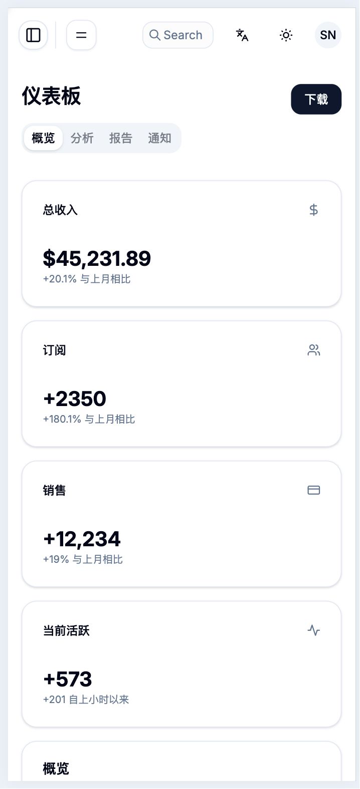

<p align="right">
  <a href="./README.md">
    
  </a>
</p>

# ChatX - 现代化智能聊天应用

<p align="center">
  
  
</p>

ChatX 是一个功能强大的全栈聊天应用程序，旨在提供无缝的沟通、协作和智能文件管理体验。它采用现代技术栈构建，前端注重用户体验和可定制性，后端提供稳定、可扩展的企业级服务。

## ✨ 核心功能

### 前端 (UI/UX)
- **实时消息**：提供流畅的即时通讯体验。
- **企业级页面切换动画**：内置 6 种专业动画效果（渐变、滑动、缩放等）。
- **高级外观定制**：支持浅色/深色模式、自定义颜色方案、圆角、字体大小等。
- **响应式与无障碍设计**：在所有设备上都能良好运行，并尊重用户的无障碍偏好。
- **现代UI组件**：基于 shadcn/ui 构建，美观且易于使用。
- **全面的文档管理界面**：以用户为中心的设计，提供直观的文档工作流管理导航。

### 后端 (API & 服务)
- **企业级文档管理系统**：
    - **文档生命周期**：从上传到归档的完整文档工作流，支持版本控制。
    - **智能组织**：层级文件夹、智能分类和灵活的标签管理系统。
    - **高级搜索**：多维度过滤、语义搜索和基于内容的发现。
    - **安全分享**：带有密码保护和访问控制的限时分享链接。
    - **存储分析**：详细的使用统计和存储优化洞察。
    - **文件操作**：上传/下载/删除/重命名，基于 SHA256 的文件去重。
    - **内容智能**：11+ 种文件类型的自动识别与智能分类。
- **用户认证与管理**：基于 JWT 的安全认证、会话管理和用户信息管理。
- **向量搜索集成**：通过 Weaviate 实现文档内容的语义搜索。
- **知识图谱关联**：利用 Neo4j 进行数据关系分析。
- **异步任务处理**：使用 Celery 处理耗时任务，如文件处理和通知。

## 🚀 技术架构

### 前端技术栈
- **UI 框架**: [React](https://react.dev/)
- **构建工具**: [Vite](https://vitejs.dev/)
- **语言**: [TypeScript](https://www.typescriptlang.org/)
- **UI 组件库**: [ShadcnUI](https://ui.shadcn.com) (TailwindCSS + RadixUI)
- **路由**: [TanStack Router](https://tanstack.com/router/latest)
- **动画**: [Framer Motion](https://www.framer.com/motion/)
- **认证**: [Clerk](https://go.clerk.com/GttUAaK)

### 后端技术栈
- **Web 框架**: [FastAPI](https://fastapi.tiangolo.com/)
- **语言**: [Python 3.11+](https://www.python.org/)
- **容器化**: [Docker](https://www.docker.com/) & Docker Compose
- **反向代理**: Nginx
- **数据库**:
    - **关系型**: PostgreSQL
    - **向量**: Weaviate
    - **知识图谱**: Neo4j
- **缓存**: Redis
- **文件存储**: MinIO
- **异步任务**: Celery

## 🏁 快速开始

请遵循以下步骤在本地启动并运行 ChatX 进行开发。

### 前置要求
- [Docker](https://www.docker.com/get-started) 和 Docker Compose
- [Node.js](https://nodejs.org/) (v18+) 和 [pnpm](https://pnpm.io/installation)

### 步骤 1: 启动后端服务

后端所有依赖服务（数据库、缓存、文件存储等）都通过 Docker 管理，方便一键启动。

```bash
# 进入后端目录
cd backend

# 复制环境变量文件模板
cp .env.example .env

# (可选) 根据需要修改 .env 文件中的端口或密码配置

# 启动所有后端服务（包括 FastAPI 应用）
# 此脚本会赋予执行权限并启动容器
chmod +x start.sh && ./start.sh
```
启动后，可以通过 `docker-compose ps` 确认所有服务都处于 `Up` 状态。

**后端主要访问地址:**
- **API 文档 (Swagger)**: http://localhost/docs
- **MinIO 控制台**: http://localhost/minio
- **Neo4j 浏览器**: http://localhost/neo4j

### 步骤 2: 启动前端开发服务器

```bash
# 进入前端目录
cd frontend

# 安装依赖
pnpm install

# (可选) 复制并配置前端环境变量
# cp .env.example .env

# 启动前端开发服务器
pnpm run dev
```

### 步骤 3: 访问应用

一切就绪！现在您可以在浏览器中打开 [http://localhost:5173](http://localhost:5173) 来访问 ChatX 应用。

## 📁 项目结构

```
chatx-main/
├── backend/            # 后端 FastAPI 应用和所有服务配置
│   ├── app/            # FastAPI 核心代码
│   ├── nginx/          # Nginx 配置文件
│   ├── docker-compose.yml # Docker 编排文件
│   └── ...
├── frontend/           # 前端 React 应用
│   ├── src/            # React 核心代码
│   ├── public/         # 静态资源
│   ├── package.json    # 前端依赖配置
│   └── ...
├── .github/            # GitHub 相关配置 (CI/CD, 模板等)
├── README.md           # 本项目说明文件
└── .gitignore          # Git 忽略配置
```

## 🤝 贡献

我们欢迎任何形式的贡献！请阅读我们的 [CONTRIBUTING.md](./.github/CONTRIBUTING.md) 文件，了解我们的行为准则以及提交拉取请求的流程。

## 📄 许可证

本项目根据 [MIT 许可证](./frontend/LICENSE) 授权。

---
由 [@Leon (Luohao-Yan)](https://github.com/Luohao-Yan) 精心打造 🤍
