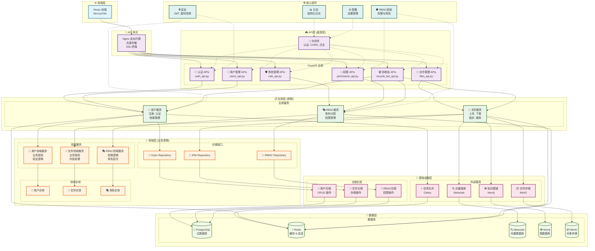

<p align="right">
  <a href="./README.md">
    
  </a>
</p>

# ChatX - 现代化智能聊天应用

<p align="center">
  
  
</p>
<p align="center">
  
  
</p>

ChatX 是一个功能强大的全栈聊天应用程序，旨在提供无缝的沟通、协作和智能文件管理体验。它采用现代技术栈构建，前端注重用户体验和可定制性，后端提供稳定、可扩展的企业级服务。

## ✨ 核心功能

### 前端 (UI/UX)

- **实时消息**：提供流畅的即时通讯体验。
- **企业级页面切换动画**：内置 6 种专业动画效果（渐变、滑动、缩放等）。
- **高级外观定制**：支持浅色/深色模式、自定义颜色方案、圆角、字体大小等。
- **响应式与无障碍设计**：在所有设备上都能良好运行，并尊重用户的无障碍偏好。
- **现代UI组件**：基于 shadcn/ui 构建，美观且易于使用。
- **全面的文档管理界面**：以用户为中心的设计，提供直观的文档工作流管理导航。

### 后端 (API & 服务)

- **企业级多租户架构**：
  - **租户隔离**：租户间数据和资源完全隔离。
  - **多租户安全**：租户特定访问控制的高级中间件。
  - **资源配额**：按租户限制和使用监控。
  - **租户管理**：动态租户创建和配置。

- **高级RBAC权限系统**：
  - **基于角色的访问控制**：具有层级角色的全面RBAC。
  - **细粒度权限**：资源级和操作级权限控制。
  - **权限继承**：具有权限继承的角色层次结构。
  - **动态权限分配**：运行时权限授予和撤销。
  - **审计日志**：完整的权限变更跟踪和审计记录。
  - **默认角色**：从访客到超级管理员的6个预定义角色。
  - **自定义角色**：创建和管理具有特定权限的自定义角色。

- **企业级文档管理系统**：
  - **文档生命周期**：从上传到归档的完整文档工作流，支持版本控制。
  - **智能组织**：层级文件夹、智能分类和灵活的标签管理系统。
  - **高级搜索**：多维度过滤、语义搜索和基于内容的发现。
  - **安全分享**：带有密码保护和访问控制的限时分享链接。
  - **存储分析**：详细的使用统计和存储优化洞察。
  - **文件操作**：上传/下载/删除/重命名，基于 SHA256 的文件去重。
  - **内容智能**：11+ 种文件类型的自动识别与智能分类。

- **高级认证与用户管理**：
  - **基于JWT的安全**：带有刷新令牌的安全基于令牌的认证。
  - **会话管理**：多设备会话跟踪和管理。
  - **用户注册**：带有邮箱验证的完整用户入门流程。
  - **密码恢复**：带有验证码的安全密码重置。
  - **用户档案**：全面的用户档案管理。
  - **第三方集成**：已准备好OAuth2、LDAP、SAML支持。

- **向量搜索集成**：通过 Weaviate 实现文档内容的语义搜索。
- **知识图谱系统**：利用 Neo4j 进行数据关系分析，支持交互式可视化。
- **实时数据可视化**：前后端集成的动态知识图谱探索。
- **异步任务处理**：使用 Celery 处理耗时任务，如文件处理和通知。

## 🚀 技术架构

### 前端技术栈

- **UI 框架**: [React](https://react.dev/)
- **构建工具**: [Vite](https://vitejs.dev/)
- **语言**: [TypeScript](https://www.typescriptlang.org/)
- **UI 组件库**: [ShadcnUI](https://ui.shadcn.com) (TailwindCSS + RadixUI)
- **路由**: [TanStack Router](https://tanstack.com/router/latest)
- **动画**: [Framer Motion](https://www.framer.com/motion/)
- **认证**: [Clerk](https://go.clerk.com/GttUAaK)

### 后端技术栈

- **Web 框架**: [FastAPI](https://fastapi.tiangolo.com/)
- **语言**: [Python 3.11+](https://www.python.org/)
- **容器化**: [Docker](https://www.docker.com/) & Docker Compose
- **反向代理**: Nginx
- **数据库**:
  - **关系型**: PostgreSQL
  - **向量**: Weaviate
  - **知识图谱**: Neo4j
- **缓存**: Redis
- **文件存储**: MinIO
- **异步任务**: Celery

## 🏁 快速开始

请遵循以下步骤在本地启动并运行 ChatX 进行开发。

### 前置要求

- [Docker](https://www.docker.com/get-started) 和 Docker Compose
- [Node.js](https://nodejs.org/) (v18+) 和 [pnpm](https://pnpm.io/installation)

### 步骤 1: 启动后端服务

后端所有依赖服务（数据库、缓存、文件存储等）都通过 Docker 管理，方便一键启动。

```bash
# 进入后端目录
cd backend

# 复制环境变量文件模板
cp .env.example .env

# (可选) 根据需要修改 .env 文件中的端口或密码配置

# 启动所有后端服务（包括 FastAPI 应用）
# 此脚本会赋予执行权限并启动容器
chmod +x start.sh && ./start.sh
```

启动后，可以通过 `docker-compose ps` 确认所有服务都处于 `Up` 状态。

**后端主要访问地址:**

- **API 文档 (Swagger)**: <http://localhost/docs>
- **MinIO 控制台**: <http://localhost/minio>
- **Neo4j 浏览器**: <http://localhost/neo4j>

### 步骤 2: 启动前端开发服务器

```bash
# 进入前端目录
cd frontend

# 安装依赖
pnpm install

# (可选) 复制并配置前端环境变量
# cp .env.example .env

# 启动前端开发服务器
pnpm run dev
```

### 步骤 3: 访问应用

一切就绪！现在您可以在浏览器中打开 [http://localhost:5173](http://localhost:5173) 来访问 ChatX 应用。

## 🏗️ 架构重构总结

本项目最近经过重构，遵循**清洁架构**和**领域驱动设计 (DDD)** 原则，实现了**分层聚合模式**，以提高代码组织性、可维护性和可扩展性。

### 🔄 最新架构重构 (2024)

#### **重构前后架构对比**


#### **🎯 重构目标**

- ✅ **关注点分离**: 各层之间界限清晰
- ✅ **依赖倒置**: 高层模块不依赖低层模块
- ✅ **可测试性**: 每层都可以独立测试
- ✅ **可扩展性**: 易于添加新功能和模块
- ✅ **可维护性**: 减少代码重复，提高可读性

#### **🏗️ 完整后端架构**



#### **🏛️ 架构组件分解**

| 层级 | 组件 | 职责 | 技术栈 |
|------|------|------|--------|
| **🌐 前端** | React 应用 | 用户界面，用户交互 | React, TypeScript, Vite |
| **🔄 API网关** | Nginx 反向代理 | 负载均衡，SSL终端，路由 | Nginx |
| **🎮 API层** | FastAPI 控制器 | HTTP请求处理，参数验证 | FastAPI, Pydantic |
| **📋 应用层** | 应用服务 | 业务流程编排，用例实现 | Python, Async/Await |
| **🎯 领域层** | 领域服务 | 核心业务逻辑，业务规则 | Pure Python Logic |
| **🔧 基础设施** | 仓储实现 | 数据访问，外部服务集成 | SQLAlchemy, Async |
| **💾 数据层** | 多种数据库 | 数据持久化，缓存，存储 | PostgreSQL, Redis, etc. |

#### **🔗 数据流架构**


#### **🐳 部署架构**


#### **📁 重构后项目结构**

```text
backend/app/
├── 🌐 api/                    # API层 (表现层)
│   ├── endpoints/v1/          # 薄控制器
│   │   ├── auth_api.py        # 认证端点
│   │   ├── users_api.py       # 用户管理端点
│   │   ├── files_api.py       # 文件管理端点
│   │   ├── role_api.py        # 角色管理端点
│   │   ├── permission_api.py  # 权限管理端点
│   │   └── recycle_bin_api.py # 回收站端点
│   └── v1/                    # API版本路由
│       └── __init__.py        # 路由注册
│
├── 📋 application/            # 应用层 (用例)
│   └── services/              # 应用服务 (编排)
│       ├── user_service.py    # 用户业务工作流
│       ├── file_service.py    # 文件业务工作流
│       └── rbac_service.py    # RBAC业务工作流
│
├── 🎯 domain/                 # 领域层 (业务逻辑)
│   ├── entities/              # 核心业务对象
│   │   ├── user_entities.py   # 用户领域实体
│   │   ├── file_entities.py   # 文件领域实体
│   │   └── rbac_entities.py   # RBAC领域实体
│   ├── repositories/          # 仓储接口 (抽象)
│   │   ├── user_repository.py # 用户仓储接口
│   │   ├── file_repository.py # 文件仓储接口
│   │   └── rbac_repository.py # RBAC仓储接口
│   └── services/              # 领域服务 (业务规则)
│       ├── user_domain_service.py   # 用户业务逻辑
│       ├── file_domain_service.py   # 文件业务逻辑
│       └── rbac_domain_service.py   # RBAC业务逻辑
│
├── 🔧 infrastructure/         # 基础设施层 (技术细节)
│   └── repositories/          # 仓储实现
│       ├── user_repository.py # 用户数据库操作
│       ├── file_repository.py # 文件数据库操作
│       └── rbac_repository.py # RBAC数据库操作
│
├── core/                      # 核心应用组件
├── models/                    # 数据库模型 (SQLAlchemy)
├── schemas/                   # Pydantic 模式 (API契约)
├── utils/                     # 工具函数 & 依赖注入
├── middleware/                # 自定义中间件
└── tasks/                     # Celery 异步任务
```

#### **🔄 迁移总结**

| 组件 | 重构前 | 重构后 | 优势 |
|-----------|--------|-------|----------|
| **控制器** | 带业务逻辑的胖控制器 | 薄控制器 (仅HTTP) | 更好分离，易于测试 |
| **业务逻辑** | 混杂在控制器和服务中 | 集中在领域服务中 | 单一职责，可重用 |
| **数据访问** | 控制器直接数据库调用 | 仓储模式与接口 | 可测试，可替换实现 |
| **依赖关系** | 层间紧耦合 | 依赖注入模式 | 松耦合，更好测试 |
| **代码结构** | 单体服务文件 | 模块化分层架构 | 易维护和扩展 |

#### **🚀 关键改进**

1. **🎯 薄控制器**: API控制器现在只处理HTTP关注点 (请求/响应，验证)
2. **📋 应用服务**: 编排业务工作流并协调领域服务
3. **🎯 领域服务**: 包含不依赖外部的纯业务逻辑
4. **🔧 仓储模式**: 通过接口和实现抽象数据访问
5. **💉 依赖注入**: 通过工厂函数管理清洁依赖
6. **🧹 代码去重**: 消除冗余代码并整合功能

#### **🔧 技术实现**

```python
# 示例: 薄控制器模式
@router.post("/register", response_model=UserSchema)
async def register_user(
    user_data: UserCreate,
    user_service: UserService = Depends(get_user_service)  # DI
):
    """用户注册"""
    return await user_service.register_user(user_data)

# 示例: 应用服务模式
class UserService:
    def __init__(self, user_repo: IUserRepository, ...):
        self.user_repo = user_repo
        self.domain_service = UserDomainService()
    
    async def register_user(self, user_data: UserCreate) -> User:
        # 1. 领域验证
        is_valid, error = self.domain_service.validate_user_registration(...)
        # 2. 业务工作流
        # 3. 仓储操作
        return await self.user_repo.create(user_data)

# 示例: 仓储模式
class IUserRepository(ABC):
    @abstractmethod
    async def create(self, user_data: dict) -> User:
        pass

class UserRepository(IUserRepository):
    async def create(self, user_data: dict) -> User:
        # 数据库实现
        pass
```

#### **✅ 重构成果**

- **✅ 代码整洁**: 消除了"代码屎山"(code garbage)
- **✅ 可维护性**: 清晰的关注点分离
- **✅ 可测试性**: 每层独立可测试
- **✅ 可扩展性**: 易于添加新模块和功能
- **✅ 最佳实践**: 遵循行业标准模式

## 📁 项目结构

```text
chatx-main/
├── backend/            # 后端 FastAPI 应用和所有服务配置
│   ├── app/            # FastAPI 核心源代码
│   │   ├── api/        # API 端点和路由定义
│   │   │   ├── endpoints/v1/  # 新分层API结构
│   │   │   │   ├── auth_api.py       # 认证API
│   │   │   │   ├── users_api.py      # 用户管理API
│   │   │   │   ├── files_api.py      # 文件管理API
│   │   │   │   ├── role_api.py       # 角色管理API
│   │   │   │   ├── permission_api.py # 权限管理API
│   │   │   │   └── recycle_bin_api.py # 回收站API
│   │   │   └── v1/     # API版本路由
│   │   ├── application/       # 应用层 (用例)
│   │   │   └── services/      # 应用服务 (编排)
│   │   ├── domain/           # 领域层 (业务逻辑)
│   │   │   ├── entities/     # 核心业务对象
│   │   │   ├── repositories/ # 仓储接口
│   │   │   └── services/     # 领域服务 (业务规则)
│   │   ├── infrastructure/   # 基础设施层 (技术细节)
│   │   │   └── repositories/ # 仓储实现
│   │   ├── core/       # 核心应用组件
│   │   │   ├── permissions.py       # RBAC权限系统
│   │   │   ├── security.py          # 认证与安全
│   │   │   ├── rbac_init.py          # RBAC初始化
│   │   │   └── banner.py            # 应用启动横幅
│   │   ├── models/     # 数据库模型
│   │   │   ├── user_models.py       # 用户, 角色, 权限模型
│   │   │   ├── tenant_models.py     # 多租户模型
│   │   │   ├── org_models.py        # 组织模型
│   │   │   └── file_models.py       # 文件管理模型
│   │   ├── schemas/    # Pydantic 模式
│   │   │   ├── user_schemas.py      # 用户数据模式
│   │   │   ├── rbac_schemas.py      # RBAC模式
│   │   │   └── file_schemas.py      # 文件模式
│   │   ├── middleware/ # 自定义中间件
│   │   ├── tasks/      # Celery 异步任务
│   │   ├── utils/      # 工具函数 & 依赖注入
│   │   └── knowledge/  # 知识图谱API端点和服务
│   ├── nginx/          # Nginx 配置文件
│   ├── docker-compose.yml # Docker 编排文件
│   ├── start.sh        # Docker 启动脚本
│   ├── dev-start.sh    # 本地开发启动脚本
│   ├── init_rbac.py    # RBAC 系统初始化脚本
│   ├── test_auth.py    # 用户认证测试脚本
│   ├── test_rbac.py    # RBAC 权限测试脚本
│   ├── requirements.txt # Python 依赖
│   ├── README.md       # 后端文档
│   └── RBAC_SYSTEM.md  # RBAC 系统文档
├── frontend/           # 前端 React 应用
│   ├── src/            # React 核心源代码
│   │   ├── components/knowledge-graph/ # 基于ECharts的可视化组件
│   │   ├── hooks/use-graph-theme.ts   # 图表主题集成
│   │   ├── routes/knowledge/          # 知识图谱路由
│   │   └── ...
│   ├── public/         # 静态资源
│   ├── package.json    # 前端依赖配置
│   └── ...
├── .github/            # GitHub 相关配置 (CI/CD, 模板等)
├── README.md           # 本项目说明文件 (英文)
├── README.zh-CN.md     # 项目说明文件 (中文)
└── .gitignore          # Git 忽略配置
```

## 🤝 贡献

我们欢迎任何形式的贡献！请阅读我们的 [CONTRIBUTING.md](./.github/CONTRIBUTING.md) 文件，了解我们的行为准则以及提交拉取请求的流程。

## 📄 许可证

本项目根据 [MIT 许可证](./frontend/LICENSE) 授权。

---
由 [@Leon (Luohao-Yan)](https://github.com/Luohao-Yan) 精心打造 🤍
